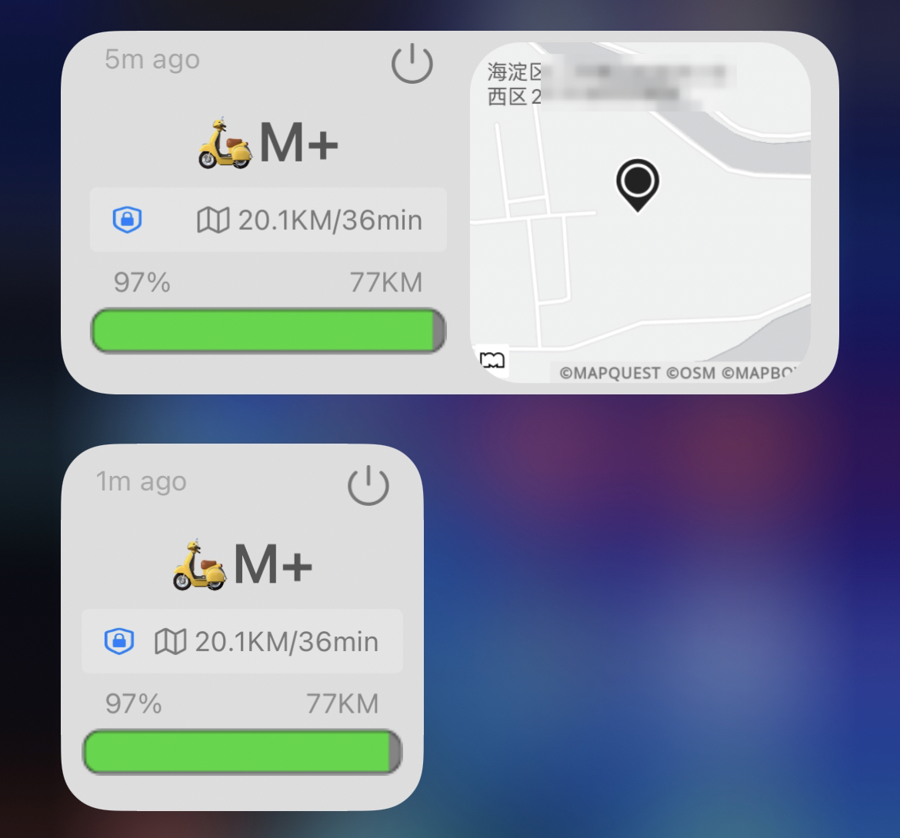
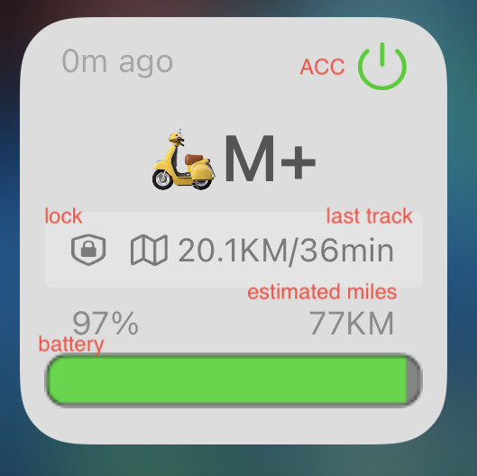

# NiuData Widget

[[English](README.md)] [[中文](README_CN.md)]

A Scriptable widget to display NIU electric scooter data on your iPhone. 

 &nbsp; 
 &nbsp;


## Usage
### Install

* Get Scriptable in the Apple App Store.
* Download the `NiuDataWidget.js` file to your `iCloud/Scriptable` folder (or create a new widget in the scriptable app).
* Fill `username`, `password`, and `sn` in `NiuDataWidget.js`
    * Set password to `md5(password)`.

```
var username = "";
var password = "";
var sn = "";
```

### Optional/Advanced
* Get a [map API key from MapQuest](https://developer.mapquest.com/) and add it to your `NiuDataWidget.js` file.

## Features

This widget support:
* charging overview (current charge and time until charge complete)
* locked/unlocked
* acc on/off
* battery connect indicator, display centre control battery if battery disconnected
* time since the data was retreived from the car
* map location of the current position

## Special Thanks

Special thanks to [DrieStone](https://github.com/DrieStone). This project used
part of the code of
[TeslaData-Widget](https://github.com/DrieStone/TeslaData-Widget).
