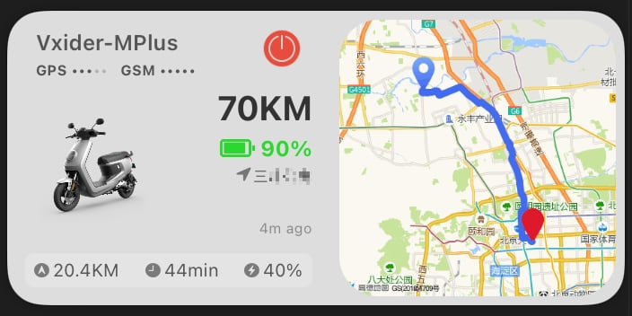
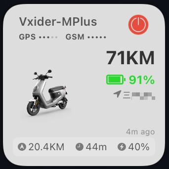

# 小牛电动车小组件

[[English](README.md)] [[中文](README_CN.md)]

Scriptable小牛电动车信息显示小组件




## 用法
### 安装

* 在APP商店里下载安装软件Scriptable.
* 下载文件`NiuDataWidget.js`，拷贝至`iCloud/Scriptable`目录.
* 设置`NiuDataWidget.js`文件中的`username`、 `password`、及`sn`字段.
    * `sn`字段在`小牛app->我的设备->配置信息`里查看
    * `password`字段需填写MD5加密后的值(可使用[在线MD5加密工具](http://www.md5.cz/)生成).

```
var username = "";
var password = "";
var sn = "";
```

### 高级选项
* 获取[地图API key](https://developer.mapquest.com/)并填写于文件`NiuDataWidget.js`.
* 无需显示地图信息，在`NiuDataWidget.js`文件中设置
    * `var show_last_track_map = false`
    * `var hide_map = true`
* 地图位置如需显示车辆定位，在`NiuDataWidget.js`文件中设置
    * `var show_last_track_map = false`
    * `var hide_map = false`
* 地图位置如需显示最近旅程，在`NiuDataWidget.js`文件中设置
    * `var show_last_track_map = true`
    * `var hide_map = true`

## 功能

插件功能:
* 充电状态显示
* 设防状态显示
* 启动状态显示
* GPS、GSM信号强度显示
* 电池状态显示，电池连接时显示电池电量，断开时显示中控电量
* 上次更新时间
* 车辆位置信息地图显示
* 最近旅程信息显示

## 特别感谢

本项目实现时参照并使用了[TeslaData-Widget](https://github.com/DrieStone/TeslaData-Widget)代码
